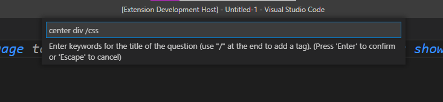
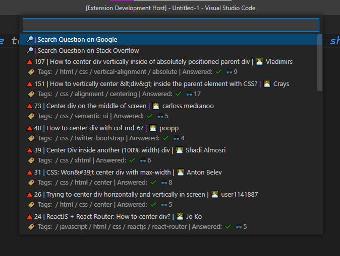

# Quick Stack Overflow search 

This extension adds a quick way to search something on Stack Overflow 
## Features

####There are 3 types of searches

- search from input
    use `CTRL+Shift+e` or open the `show all Commands` prompt to use it. Enter keywords for
    your Question and additionally a tag with `/yourTag`
    A tag can be `js, css, python, etc...`.
   
 

- search from clipboard
     use `CTRL+Shift+c` or press `right click` and select `Search clipboard on Stack Overflow` to use it.
     It will automaticly search for the content in your clipboard.
 
 

- search from selection
     use `CTRL+Shift+s` or press `right click` and select `Search selection on Stack Overflow` to use it (*Note:* it is only available if you select something).
     It will automaticly search for the content you selected.

 

> if you type ***soso*** (search on Stack Overflow) you will get all available commands.

> If you dont get any results or they dont fit, you can click Google or Stack Overflow search to search it directl on Google/Stack Overflow

###Example

- 🔎: Search the question directly in Google or Stack overflow
- 🔺: Score of the question
- 🏷️: Tags of the question
- 👨‍💻: Person asking the question
- ✔️: Question marked as answered
- 🤔: Question not marked as answered
- 👓: Number of views the question got

---
### 1.0.0

Finished version of the extension.